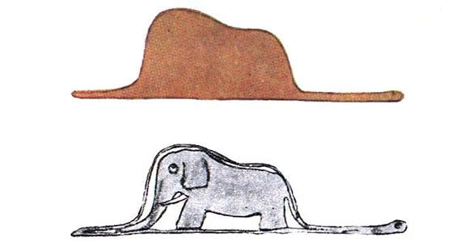

```{r setup, include=FALSE}
knitr::opts_chunk$set(echo = TRUE)
# RStudio Version 1.1.442 
# DATA_DIR = "/home/william/Downloads/Dados/TSE/mz"
DATA_DIR = "/home/william/temp/dd/mz"

```

```{r load data, echo=FALSE}
source("aux.R")  # TODO: Como garantir que o source ocorre apenas uma vez? Isso faz diferença?
library(knitr)

anoturno = function(ano, turno) {
  ano_s = as.character(ano)
  paste0(ano_s, "_", turno)
}

dados = list()
for (ano in c(1998, 2002, 2006, 2010, 2014)) {
  for (turno in c("1", "2")) {
    
    filename = paste0(DATA_DIR, "/", anoturno(ano, turno), ".csv")
    
    if (!file.exists(filename)) {
      stop(paste("Arquivo", filename, "não existe"))
    }
    
    df = read.csv(filename, encoding = "ISO-8859", sep = ",", stringsAsFactors = F)

    dados[[anoturno(ano, turno)]] = list(ANO=ano, TURNO=turno, DF=df)
  }
}
```


<!-- ## Distribuições de frequências -->

Foram investgadas as aderências dos dados à distribuição Normal. Nas próximas seções, aparecem os resultados dos testes demonstrando que, embora uma ou outra amostra se aproxime razoavelmente da N~, a maioria diverge fortemente dela.

## Densidades

### Quantidades de eleitores aptos
```{r qtd_aptos_density, echo=FALSE, fig.height=3, fig.width=3}
# source("aux.R")
for (item in dados) {
  ## item = dados[[1]]
  df <- item$DF
  # print(paste(item$ANO, " ", length(item$DF$QTD_APTOS), nrow(df)))
  # print(df$QTD_APTOS)
  # print(item$DF$QTD_APTOS)
  titulo <- paste(item$ANO, item$TURNO, "turno")
  # titulo <- paste("Densidade de QTD_APTOS em ", item$ANO, item$TURNO, "turno")
  plot(density(df$QTD_APTOS), main = titulo)
}
```

### Quantidades de eleitores *ausentes*
```{r qtd_ausentes_density, echo=FALSE, fig.height=3, fig.width=3}
for (item in dados) {
  df <- item$DF
  titulo <- paste(item$ANO, item$TURNO, "turno")
  plot(density(df$QTD_ABSTENCOES), main = titulo, sub="Ausentes")
}
```

### Taxa de abstenção
```{r Taxa_Abstencao_density, echo=FALSE, fig.height=3, fig.width=3}
# source("aux.R")
for (item in dados) {
  df <- item$DF
  titulo <- paste(item$ANO, item$TURNO, "turno")
  plot(density(df$TAXA_ABSTENCAO), main = titulo)
}
```

Algumas funções de densidade lembram uma Distribuição Saint-Exupery


### Gráficos qq
Outra forma de visualizar a semelhança da distribuição dos dados com a Normal é o gráfico quantil-quantil gerado pela função `qqnorm`.

#### Quantidade de eleitores aptos
```{r QTD_APTOS qqplot, echo=FALSE, fig.height=3, fig.width=3}
# source("aux.R")
for (item in dados) {
  df <- item$DF
  titulo <- paste(item$ANO, item$TURNO, "turno")
  qqnorm(df$QTD_APTOS, main = titulo)
  qqline(df$QTD_APTOS)
}
```


#### Quantidade de eleitores ausentes
```{r QTD_ABSTENCOES qqplot, echo=FALSE, fig.height=3, fig.width=3}
# source("aux.R")
for (item in dados) {
  df <- item$DF
  titulo <- paste(item$ANO, item$TURNO, "turno")
  qqnorm(df$QTD_ABSTENCOES, main = titulo)
  qqline(df$QTD_ABSTENCOES)
}
```


#### Taxas de abstenção
```{r Taxa_Abstencao_qqplot, echo=FALSE, fig.height=3, fig.width=3}
# source("aux.R")
for (item in dados) {
  df <- item$DF
  titulo <- paste(item$ANO, item$TURNO, "turno")
  qqnorm(df$TAXA_ABSTENCAO, main = titulo)
  qqline(df$TAXA_ABSTENCAO)
}
```

## Testes de Shapiro-Wilk e Kolmogorov-Smirnov

```{r Shapiro abstencoes, echo=FALSE} 
#, results='asis'}

testes_norm = data.frame(
  ano_turno=NA,
  W = 0,
  W_p = 0,
  D = 0,
  D_p = 0
)

cnt=1
for (item in dados) {
  df <- item$DF
  titulo <- paste(item$ANO, item$TURNO, "turno")
  
  S = shapiro.test(df$TAXA_ABSTENCAO)
  K = ks.test(to_z(df$TAXA_ABSTENCAO), "pnorm")
  # print("==================================================================")
  testes_norm[cnt, ] = list(
    ano_turno = titulo,
    S$statistic,
    S$p.value,
    K$statistic,
    K$p.value
  )
  cnt = cnt+1
}

kable(testes_norm)
```


## Médias e desvios-padrão, por turno

```{r}
for (ano in c(1998, 2002, 2006, 2010, 2014)) {
  for (turno in c("1", "2")) {
    #print(anoturno(ano, turno))
    
  }
}
```

